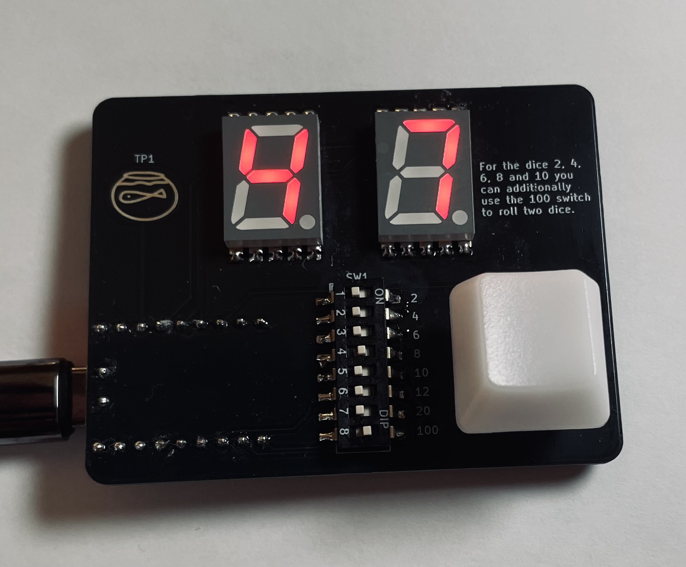
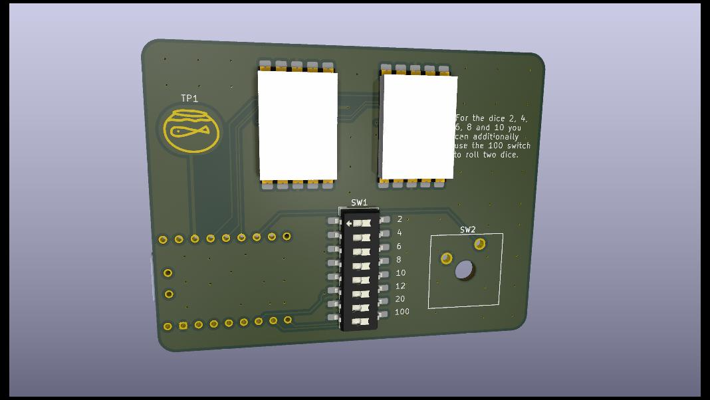

# 7-segment-dice

A digital dice using shift-register daisy-chaining and custom PCB design. Also it uses 7 segment displays, in case you didn't realize from the name.

# Technologies used

- Uses 74HC595 and 74HC165 **shift registers** to minimize GPIO usage (only 6 pins to control 24+ I/O points)
- Custom PCB designed in KiCad and manufactured with JLCPCB
- **Bitwise logic** using a dipswitch and the shift register

# Custom PCB

The PCB was designed with KiCad. Only a few components are needed: 

## Bill of Materials (BOM)

| Component | Quantity | Package / Size | Description |
| :--- | :---: | :--- | :--- |
| **ESP32-S3 SuperMini** | 1 | Module | Main MCU with 4MB Flash (no PSRAM) |
| **74HC595** | 2 | SOP-16 | 8-bit Output Shift Register (Display Drive) |
| **74HC165** | 1 | SOP-16 | 8-bit Input Shift Register (DIP Switch) |
| **7-Segment Display** | 2 | SMD | Common Cathode, Single Digit, 0.56 inch |
| **DIP Switch** | 1 | SMD DIP-16 | 8-Position Slide Switch |
| **Mechanical Key Switch** | 1 | Through-hole Cherry Style | "Dice Throw" Trigger Button |
| **Resistor** | 16 | 0805 | 220Ω (LED Current Limiting) |
| **Resistor** | 8 | 0805 | 10kΩ (DIP Switch Pull-ups) |
| **Capacitor** | 3 | 0805 | 100nF (Decoupling) |
